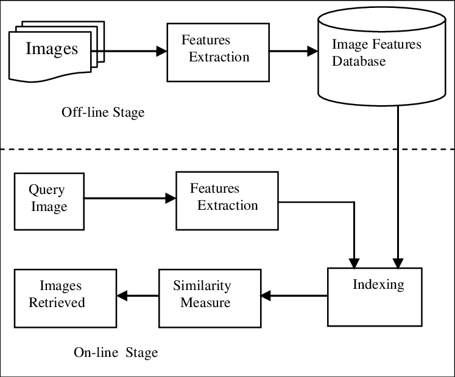

<h1 style="text-align: center;">
   
  Content and Text Based Image Retrieval Search Engine
</h1>

 

## Context
An image search engine that covers annotated images from [Open Images Dataset](https://storage.googleapis.com/openimages/web/index.html). This search engine enables its users to search using text, images or a combination of both.

## Pipeline
This project is brought down into these steps:
- Download the dataset
- Extract features from image database
- Data indexing using ElasticSearch python client
- Insert the query image and extract its features
- Calculate the similarities with all images
- Retrieve the most similar result
### Data processing

### Data indexing
Data indexing is performed using ElasticSearch python client. This operation is split into two tasks:
1. Indexing text data.
2. Indexing image feature vectors using Elastiknn plugin.
### Application development
The web application is developed using:
- ElasticSearch python client: to query elasticsearch index.
- FastAPI : to develop an API to enable querying from the web application.
- Streamlit : to design a frontend for the application where users perform text and image search.

<!-- More about this process is available in this detailed [report](/docs). -->